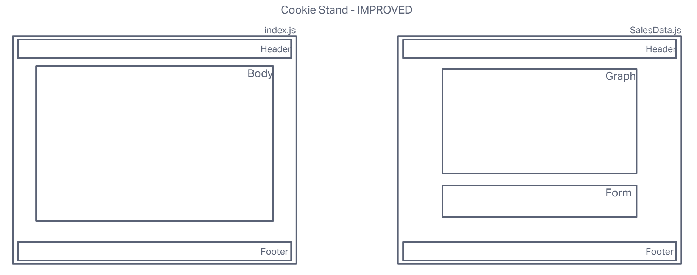

# LAB - CodeFellows Class 40

<<<<<<< HEAD
Framework Name Next
Research Conducted By: The Helpful Heather, The Keen Kaeden, The Impressive Ike, The Resourceful Reece
Overall Score and Comments
Score (Out of 10): 8
General Comments
=======
## Project: Javascript and Web Frameworks

### Authors: Reece Renninger, Kaeden O'meara, Heather Holcomb, Ike Steoger

### Problem Domain

- Visit and re-familiarize yourself with the [Salmon Cookies Project](https://ikesteoger.github.io/cookie-stand/)
- Create a new repository for your work, with the name of the framework you have been assigned.

### Links and Resources

- [GitHub Actions ci/cd](https://github.com/ReeceRenninger/cookie-stand-improved/actions)
<!-- - [back-end server url](http://xyz.com) (when applicable) -->
- [front-end application]()

### Collaborators

Ryan Gallaway  
Nick Mullaney  
Ryan Eastman  

### Setup

<!-- #### `.env` requirements

For now I have none and do not require one -->

#### How to initialize/run your application

- Run `npm i` and then `npm start`

<!--- #### How to use your library (where applicable) --->

#### Features / Routes

- 

<!-- - GET : `/hello` - specific route to hit -->

#### Tests

- Run `npm test` to see tests running.

#### UMLs

### JS Framework Comparative Analysis

#### Framework Name Next

##### Research Conducted By: The Helpful Heather, The Keen Kaeden, The Resourceful Reece, The Impressive Ike

##### Overall Score and Comments

Score (Out of 10):

##### General Comments
>>>>>>> d2f8dff6f3b2087f1ca6e1bdacf81991ae0853e4

Describe the stack (front-end only? full stack?), database, efficiency, etc. Describe the general usability and learnability

##### Pros

- Item 1
- Item 2

##### Cons

- Item 1
- Item 2

#### Ratings and Reviews

##### Documentation

Thoughts go here

##### Systems Requirements

Above and beyond ‘node’ and ‘linux’, what dependencies or core requirements exist for this framework? Is it easily deployable to the cloud? Does it require a certain database?

##### Ramp-Up Projections

How long would/should it take a team of mid-junior developers to become productive?
Community Support and Adoption levels

How popular is this framework? What big companies are running on it? How is it “seen” in the general JS community? Is there an active community of developers supporting and growing it?

##### Framework Links and Resources

- framework
- docs
- examples/tutorials

##### Code Demos

- live/running application
- code repository

##### Operating Instructions

If someone were to download your repo (above), what steps do they need to take to run the application

- npm start
  - Endpoint: /foo/bar/
    - Returns a JSON object with abc in it.
  - Endpoint: /bing/zing/
    - Returns a JSON object with xyz in it.
